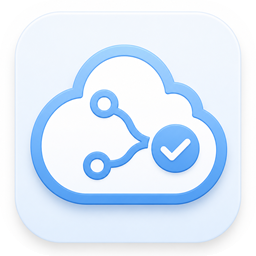

<p align="center">
  
</p>

<h1 align="center">MergePilot</h1>

<p align="center">
  <strong>Local-first Azure DevOps delivery copilot.</strong><br />
  Turn repository context into approved, verified work-item, pull-request, CI, and delivery actions.
</p>

<p align="center">
  <a href="#quick-start">Quick Start</a> ·
  <a href="#how-it-works">How it works</a> ·
  <a href="docs/product/README.md">Product docs</a> ·
  <a href="CONTRIBUTING.md">Contributing</a>
</p>

<p align="center">
  <a href="https://github.com/ZP151/mergepilot/releases"></a>
  <a href="https://github.com/ZP151/mergepilot/actions/workflows/ci.yml"></a>
</p>

## Why MergePilot

Delivery work is spread across a local repository, Azure Boards, pull requests,
pipeline runs, test evidence, and environments. MergePilot brings the evidence
together without becoming a hosted source-code service or a second system of
record.

- **Local-first.** Repository context, chat state, checkpoints, and workflow
  state stay local by default.
- **Evidence before action.** The assistant inspects the relevant repository and
  Azure DevOps state before proposing the smallest useful next step.
- **Approval and verification.** Every repository or remote mutation is shown,
  explicitly approved, executed, re-read, and verified.

Azure DevOps remains authoritative. MergePilot is the reasoning, governance,
and verified-action layer around it.

## How it works

```text
Local repository + Azure DevOps Project Link
                 ↓
Inspect evidence → Propose the next action → Approve
                 ↓
Execute → Re-read authoritative state → Verify outcome
```

1. **Connect context.** A Project Link maps a local repository to its Azure
   DevOps organization, project, repository, and target branch.
2. **Make evidence visible.** Inspect changes, work items, pull requests,
   pipeline runs, policies, tests, and environment readiness in one workspace.
3. **Keep writes intentional.** Staging, committing, pushing, creating pull
   requests, updating work items, and triggering delivery workflows require an
   explicit approval boundary.
4. **Close the loop.** MergePilot re-reads Git or Azure DevOps after the action
   and records whether the intended state was reached.

## What you can do

- Understand a local repository through source indexing and grounded chat
  context.
- Review pull requests with diff, thread, pipeline, and policy evidence.
- Discover Azure DevOps projects, repositories, work items, pull requests, and
  pipelines.
- Run approval-gated Git and delivery actions from the desktop workspace.
- Follow work-item → pull-request → CI and recovery loops with visible
  verification evidence.

MergePilot deliberately does **not** clone the Azure DevOps portal, operate as
an autonomous release authority, or expose a user-managed connector
marketplace. See the [product definition](PRODUCT.md) for the full scope and
non-goals.

## Quick start

### Requirements

- Node.js 22
- pnpm 9
- Rust, when running the Tauri desktop app from source
- An Azure DevOps project only when using connected delivery workflows

### Run the desktop app

```powershell
git clone https://github.com/ZP151/mergepilot.git
Set-Location mergepilot
corepack enable
pnpm install
pnpm --filter @mergepilot/desktop dev
```

The desktop app starts a local daemon and communicates with it over localhost.
Use **Context** to create or select a Project Link before working with Azure
DevOps artifacts.

### Verify a checkout

This repository keeps its Node.js and pnpm runtime under `.tools`. On Windows,
run checks through the project wrapper:

```powershell
.\scripts\windows\pnpm-project.ps1 --filter @mergepilot/core typecheck
.\scripts\windows\pnpm-project.ps1 --filter @mergepilot/daemon test
.\scripts\windows\pnpm-project.ps1 --filter @mergepilot/desktop test
.\scripts\windows\pnpm-project.ps1 --filter @mergepilot/desktop build
```

## Architecture

```text
Tauri desktop app
  → local daemon (HTTP and SSE)
  → planner, policy, repository index, and Azure DevOps clients
  → optional review-agent service
  → local repository and Azure DevOps
```

| Area              | Location                |
| ----------------- | ----------------------- |
| Desktop app       | `apps/desktop`          |
| Local daemon      | `packages/daemon`       |
| Planner and tools | `packages/core`         |
| Review service    | `packages/review-agent` |
| CLI               | `packages/cli`          |

## Project status

MergePilot is under active development. The current release line has automated
unit, browser, source-live, installed-desktop, and real Azure DevOps acceptance
gates; the latest projected status is recorded in
[current-gates.md](docs/manual-testing/2026-08-05/verification/current-gates.md).

The repository does not currently publish a root open-source license. Do not
assume reuse rights until a license is added.

## Documentation

- [Product and delivery plan](docs/product/README.md)
- [Product definition](PRODUCT.md)
- [Architecture](docs/architecture.md)
- [Managed connectors](docs/managed-mcp-connectors.md)
- [Verification gate report](docs/manual-testing/2026-08-05/verification/current-gates.md)

## Contributing

MergePilot is evolving quickly. Before opening a change, read
[CONTRIBUTING.md](CONTRIBUTING.md) and keep mutating workflows behind the
existing approval and verification path.

## Releases

Pushing a semantic tag triggers the Windows installer build and GitHub Release
workflow:

```powershell
git tag v0.5.32
git push origin v0.5.32
```
