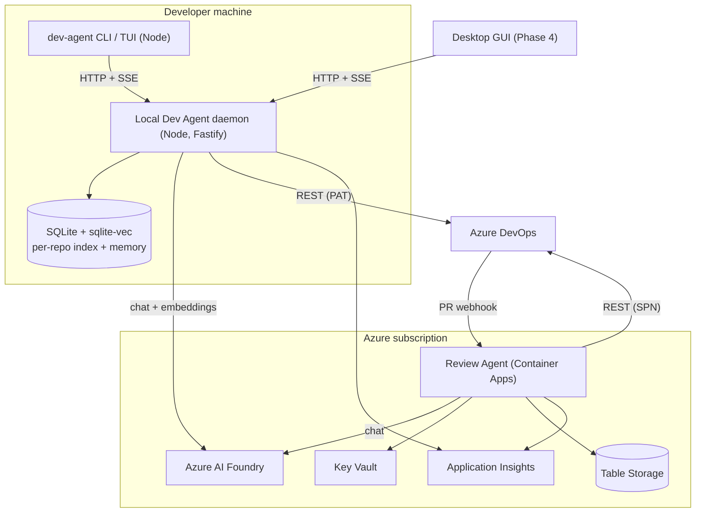
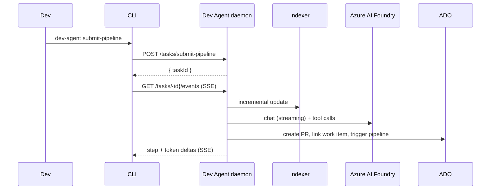
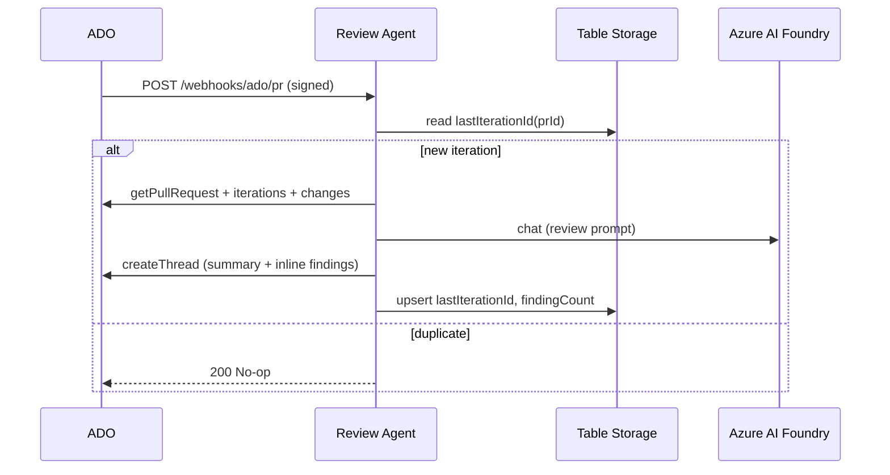

# Production architecture (v2)

This document is the consolidated output of ADRs 0001-0007. The diagrams
here are the ones embedded in [README.md](../README.md) "Production
architecture" section.

## Surfaces

## Data flow: Pipeline Agent (local)

## Data flow: Review Agent (cloud)

