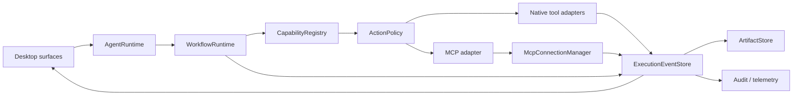

# MergePilot Agent / MCP / 开源复用架构建议

> 日期：2026-08-03。本文是 [手动测试问题分析](./manual-test-findings.md) 中 `MP-015`、`MP-016` 的工程展开，只提出后续架构与复用要求，不修改公共 API 或产品代码。

- 实施优先级见：[迭代计划](./iteration-plan.md)
- 场景级验收见：[回归验收矩阵](./regression-acceptance-matrix.md)

## 1. 决策摘要

后续迭代不应继续在 Chat、Pipeline、PR、Environment 各页面分别修补 Agent 状态。建议采取以下边界：

1. **应用继续拥有 Agent runtime。** MergePilot 的审批、风险策略、本地 checkpoint、Project Link、审计和工作流状态是产品核心，不交给外部框架。
2. **协议能力优先复用官方实现。** MCP transport、lifecycle、schema 与 cancellation 不再手写；生产基线采用官方 TypeScript SDK v1.x，v2 稳定后再评估迁移。
3. **一种执行事实，多种 UI 投影。** Chat tool card、右侧步骤、Activity、Review Run 和恢复动作都读取同一份 typed execution events，不再从 assistant prose 或多个局部 state 反推。
4. **通用能力先复用，差异化策略本地保留。** 优先使用已引入或已 vendored 的 assistant-ui、Radix UI、OpenHarness、Azure DevOps MCP、PR-Agent、CodeMirror、Tiptap 等；通过 Adapter 微调，不直接在产品层复制其内部模型。
5. **复用是受控流程，不是复制代码。** 每次采用开源实现必须记录 license、版本/commit、来源路径、修改点、上游更新方式、安全检查和退出策略。

## 2. 当前架构基线

| 层 | 当前职责 | 保留方向 | 主要缺口 |
| --- | --- | --- | --- |
| `packages/core` | planner、tool contracts、capability、ADO domain logic、MCP 最小 client | 保留 domain contract 与安全策略 | MCP transport、tool metadata 和错误类型过浅；planner 容易重复取证 |
| `packages/daemon` | session/runtime、HTTP/SSE、持久化、workflow orchestration、connector 启动 | 继续作为 application-owned runtime | typed event 还没有成为所有页面和历史的唯一事实源 |
| `apps/desktop` | workbench、Chat、Pipeline/PR/Environment、tool transcript | 保留 UI projection 与用户控制 | 页面局部状态、Chat bubble 和功能页结果存在串联 |
| `third_party` | 上游源码与 license/provenance | 继续作为可审计的 source-first intake | 缺少强制采用流程和周期性上游差异检查 |

已有可复用基础不应推倒重写：

- `ToolExecutor` 已吸收 OpenHarness 的 approval-before-execute 模式。
- `toolCapabilities()` 已给 native/MCP tools 提供风险分类入口。
- `@assistant-ui/react` 已通过本地 adapter 接入 Thread/message primitives。
- `third_party/azure-devops-mcp`、`third_party/pr-agent` 已保留固定上游 commit。
- Radix UI、CodeMirror、Mermaid、TanStack Query、Streamdown 已在桌面端依赖中。

## 3. 目标 Agent 架构

### 3.1 模块与数据流



### 3.2 深模块职责

| Interface / Module | 输入与输出 | 必须隐藏的复杂度 | 不得承担 |
| --- | --- | --- | --- |
| `AgentRuntime` | turn request → typed event stream + final outcome | model/tool loop、budget、stop、resume、finalization | 页面布局、ADO target 猜测 |
| `WorkflowRuntime` | workflow command + context → durable state transitions | step state、checkpoint、retry eligibility、blocked reason | tool transport 细节 |
| `CapabilityRegistry` | discovered tools → normalized capabilities | source、schema、domain、risk、read/write、idempotency、auth need | 最终审批决定 |
| `ActionPolicy` | normalized call + user intent → allow/approve/deny | workspace boundary、remote mutation、destructive action、credential policy | 执行 tool 本身 |
| `McpConnectionManager` | connector config → negotiated MCP session | lifecycle、transport、capability、pagination、list changes、health、cancel | 产品工作流策略 |
| `ExecutionEventStore` | runtime events → append/query/replay | stable call ID、ordering、redaction、status transition、persistence | 重新解释 assistant prose |
| `ArtifactStore` | tool output → bounded artifact reference | large output、file preview、diff、image、retention | 把大 payload 塞进 Chat bubble |
| `PipelineTargetResolver` | Project Link + user target → unique typed target | ID/name resolution、ambiguity、permission/missing classification | 触发 Pipeline |
| `ReviewPolicy` | PR facts → decision recommendation | risk/readiness/finding policy | MCP/ADO transport |

### 3.3 单一执行事件模型

建议所有执行表面消费同一组事件，至少包括：

```text
turn.started
plan.updated
tool.discovered
tool.call.proposed
tool.call.awaiting_approval
tool.call.started
tool.call.progress
tool.call.completed
tool.call.failed
tool.call.cancelled
artifact.created
workflow.blocked
workflow.completed
turn.failed
turn.cancelled
```

每条事件都应包含稳定的 `turnId`、`workflowId`、`callId`、`source`、时间戳和 redaction 状态。Chat、步骤面板和 Activity 只改变呈现，不生成新的执行事实。最终回答引用 `callId` 或 artifact，而不是重复粘贴完整命令输出。

### 3.4 终止与重试规则

- 用户 Stop → `turn.cancelled`，保留已完成证据，提供“继续未完成步骤”。
- 工具 timeout → `tool.call.failed(type=timeout)`；只有明确幂等的调用允许自动重试一次。
- connector auth expired → `workflow.blocked(type=unauthorized)`；用户授权成功后从相同 `callId` 的 retry attempt 恢复。
- 内部 Abort / invariant failure → `turn.failed(type=internal)`；不得显示为用户取消。
- 写操作不得因为 connector 失败而静默切换到另一个 connector；切换需要重新展示目标、参数和审批。

## 4. MCP 调用规范

### 4.1 规范基线

MCP 以官方 2025-06-18 specification 为当前兼容基线：初始化必须先协商 protocol version 与 capabilities，stdio 消息按换行分隔，tool discovery 需要处理分页，tool annotations 视为不可信输入，远端 mutation 应保留 human-in-the-loop。参考：[Lifecycle](https://modelcontextprotocol.io/specification/2025-06-18/basic/lifecycle)、[Transports](https://modelcontextprotocol.io/specification/2025-06-18/basic/transports)、[Tools](https://modelcontextprotocol.io/specification/2025-06-18/server/tools)。

当前 `StdioMcpClient` 使用固定 `2024-11-05`、`Content-Length` framing 和一次性 `tools/list`，属于需要替换的兼容性风险，而不是继续补条件的合适基础。

### 4.2 Connector 配置与信任边界

- MCP server 是可执行代码；Project Link 只能选择管理员或本机配置中已经审核的 connector，不能提供任意 command、args、cwd 或 secret。
- 本地 stdio child 默认只继承启动所需环境变量和显式 credential；不得继承模型 key 或完整 daemon environment。
- remote Streamable HTTP endpoint 必须位于 allowlist，使用受支持的 OAuth 流程，并记录 server identity。
- `tool annotations`、description 和 output 都是外部输入，不能单独决定审批、读写属性或安全等级。
- domain filter 应在 tools 暴露给 model 前执行；Azure DevOps 默认只启用任务需要的 domain，而非全量工具。

### 4.3 标准调用生命周期

1. **Resolve context：** 固定 Project Link、organisation、project、repository/Pipeline target，任何歧义都先返回候选而不是猜测。
2. **Preflight：** 检查 connector enabled、server health、auth、domain allowlist 和用户角色。
3. **Initialize：** 交换 protocol version、client/server info 与 capabilities；不支持的版本立即断开并类型化报错。
4. **Discover：** 按 `nextCursor` 拉取 tools，响应 `notifications/tools/list_changed`，缓存必须绑定 server identity、version 与 session。
5. **Normalize：** 将 MCP tool 映射为本地 capability，保留原始 server/tool 名、title、input/output schema 和 annotations。
6. **Validate：** 在执行前校验 arguments；缺失字段、类型错误和超出 domain 均不得进入 server。
7. **Authorize：** 本地 `ActionPolicy` 根据用户意图、target、read/write、风险和幂等性决定 allow/approve/deny。
8. **Execute：** 传播 stable call ID、timeout、cancellation 与 progress；不得无限循环等价调用。
9. **Normalize result：** 保留 text/image/audio/resource/structured content，较大结果进入 `ArtifactStore`，UI 只显示摘要与入口。
10. **Persist and audit：** 记录 source、tool、sanitized args、result summary、duration、outcome、approval actor，不记录 secret 或原始敏感 payload。
11. **Recover：** 仅对幂等 read 自动重试；authorization、ambiguous target 和 mutation failure 均要求显式恢复动作。

### 4.4 统一错误分类

| 错误类型 | 含义 | UI 主动作 | 是否自动重试 |
| --- | --- | --- | --- |
| `connector_unavailable` | connector 未启用、未启动或健康检查失败 | 打开 connector 设置 / 重连 | 最多一次健康重连 |
| `protocol_incompatible` | 协议版本或 capability 不兼容 | 查看兼容版本 | 否 |
| `unauthorized` | 尚未授权或授权过期 | `Enable access` / `Re-authorize` | 授权成功后一次 |
| `capability_missing` | domain 或 tool 不存在/已改名 | 调整 domain / 刷新工具 | tool list 刷新一次 |
| `invalid_arguments` | schema 校验失败 | 修正参数 | 否 |
| `ambiguous_target` | 名称对应多个 target | 选择明确 target | 否 |
| `timeout` | 调用超过 deadline | 重试 / 查看诊断 | 仅幂等调用一次 |
| `cancelled_by_user` | 用户主动停止 | 继续未完成步骤 | 否 |
| `tool_error` | server 返回业务错误 | 按错误给出下一步 | 依错误类型 |
| `malformed_result` | 结果不符合 schema/协议 | 查看 connector 诊断 | 否 |
| `policy_denied` | 本地策略拒绝 | 查看策略原因 | 否 |

### 4.5 Azure DevOps 路由规则

- 确定性、已封装的高价值产品流程可以继续使用本地 ADO adapter；其结果仍必须进入同一 event model。
- 新的宽领域读取优先评估官方 Azure DevOps MCP，避免重复封装每个 REST endpoint。
- 官方仓库目前推荐 remote Streamable HTTP server，并把 local stdio 作为特定场景回退；正式采用前应验证企业租户、OAuth、domain coverage、数据驻留和审计要求。参考：[microsoft/azure-devops-mcp](https://github.com/microsoft/azure-devops-mcp)。
- 同一 mutation 不能同时由 native ADO 与 MCP 执行；一次 workflow 必须固定 execution source，并使用 idempotency/duplicate detection。

## 5. 开源复用目录与建议

### 5.1 采用分级

| 级别 | 含义 | 适用条件 |
| --- | --- | --- |
| Adopt | 作为依赖或受管外部 connector 使用 | 标准协议、维护活跃、接口稳定、license 可接受 |
| Port | 移植小段行为和测试，保持本地 contract | 运行时/版本不兼容，但算法或模式成熟 |
| Reference | 研究架构和 UX，不复制实现 | 过重、语言不匹配、license/运维边界复杂 |
| Reject | 不采用 | 与安全模型冲突、缺维护、无法审计或引入重复 runtime |

### 5.2 当前优先候选

| 候选 | 建议级别 | 可复用内容 | 本地边界与微调 |
| --- | --- | --- | --- |
| [MCP TypeScript SDK](https://github.com/modelcontextprotocol/typescript-sdk) | Adopt v1.x | stdio/Streamable HTTP、lifecycle、schema、取消、OAuth helper | 用本地 `McpConnectionManager` 包装；v2 当前仍在预发布，不直接进生产 |
| [Azure DevOps MCP](https://github.com/microsoft/azure-devops-mcp) | Adopt connector + Port selected adapters | ADO tool coverage、domain、auth、target lookup | 保留本地 policy/audit；先 remote PoC，再决定 stdio 回退和 selective port |
| `third_party/open-harness` / [OpenHarness](https://github.com/MaxGfeller/open-harness) | Port | typed events、middleware、approval、tool loop | 通过 zod boundary 移植行为与测试，不强迫全仓升级 zod |
| `third_party/pr-agent` / [PR-Agent](https://github.com/qodo-ai/pr-agent) | Port | diff compression、finding taxonomy、review prompt/readiness heuristics | 只移植纯算法和 fixtures；ADO writeback 仍走本地审批与 audit |
| [assistant-ui](https://github.com/assistant-ui/assistant-ui) | Adopt existing dependency | Thread、Composer、attachment、tool/approval UI primitives | 继续通过 MergePilot adapter；先扩展已依赖的 primitives，再造新 Chat 组件 |
| [Radix UI](https://github.com/radix-ui/primitives) | Adopt existing dependency | Dialog、Dropdown、Tabs、Tooltip、accessible primitives | 为 Project Link 补统一 Combobox adapter；视觉由本地 token 控制 |
| [Tiptap](https://github.com/ueberdosis/tiptap) | Adopt core/extensions | 富文本编辑、image node、extension model | 消息边界继续 Markdown + structured attachments；先做 round-trip PoC |
| [react-easy-crop](https://github.com/ValentinH/react-easy-crop) | Adopt | crop/zoom/rotate | 只用于发送前轻量编辑，不扩成图片工作台 |
| CodeMirror / Mermaid / Streamdown | Adopt existing dependency | code preview、diagram、streaming Markdown | 统一进入 Artifact/File workspace，避免页面各自实现 viewer |
| Aider、LangGraph、OpenHands、mcp-agent | Reference | repo map、checkpoint/durable workflow、sandbox/evaluation | 只借鉴测试和状态模型；当前不替换 TypeScript daemon runtime |

### 5.3 明确“不从零写”的区域

- MCP transport、JSON-RPC parser、OAuth protocol、tool pagination 与 cancellation。
- Chat composer 的 attachment、focus、keyboard、send/stop 状态机。
- Project Link dropdown 的键盘导航、搜索、focus trap 和无障碍基础。
- diff compression、token budget 和 review finding normalization。
- code editor、Markdown renderer、diagram renderer、crop/zoom/rotate。

允许本地自研的核心差异：

- Project Link 与 workspace boundary。
- approval/risk policy、checkpoint 和 remote mutation control。
- Pipeline target resolution 与产品级恢复动作。
- Review Queue 决策策略、审计和受控写回。
- typed execution event、Activity replay 和数据保留策略。

## 6. 复用准入闸门

每个复用候选在进入实现前必须完成：

1. **Fit：** 对应哪个问题 ID、替代哪段现有逻辑、能删除多少本地重复实现。
2. **Provenance：** repository、license、version/commit、来源文件和首次引入日期进入 `docs/third-party-source-reuse.md`。
3. **Security：** 依赖供应链、secret/env、网络/文件权限、prompt injection 和远端 mutation 面。
4. **Compatibility：** Node/React/zod/TypeScript/Tauri 版本和 bundle 模式；先做最小 wrapper PoC。
5. **Contract tests：** 先用本地 Interface 写兼容测试，再接 dependency/ported code。
6. **Adapter：** 上游类型不得穿透到 UI、database schema 或 domain workflow。
7. **Divergence：** 记录本地修改、原因和是否可 upstream；vendored tree 不直接改，改动移入本地 adapter。
8. **Update plan：** 固定更新节奏、breaking change check、rollback/exit path。

Pull Request 模板建议增加以下审查问题：

- 是否查过现有 dependency、`third_party` 和 reuse registry？
- 若自研，为什么现有候选不能满足？
- 新逻辑属于 product policy 还是 generic infrastructure？
- 是否引入新的状态事实源？能否删除旧逻辑？
- 是否有 license/provenance、contract tests 和 failure/recovery tests？

## 7. 分阶段落地建议

### A. 协议与事件地基（P1）

- 为 MCP SDK 建 wrapper PoC，先覆盖 initialize、stdio newline framing、分页、tool list change、cancel 和 structured result。
- 定义 `ExecutionEvent` 与稳定 call ID；选择一个只读 Pipeline discovery 流程贯通 daemon、SSE、UI 和 persistence。
- 建立统一错误 taxonomy，删除 UI 中基于 error message 文本猜状态的路径。

### B. ADO 与 Agent 流程（P1）

- 引入 `PipelineTargetResolver`，分别覆盖 ID、唯一名称、重名、无权限和不存在。
- 对官方 remote Azure DevOps MCP 做 read-only PoC；记录与 vendored local server 的 tool/domain 差异。
- 将 planner 等价调用去重、evidence budget 和 retry policy放进 runtime，而不是 prompt 文案。

### C. UI 与开源组件整合（P2）

- 先扩展 assistant-ui adapter 的 attachment、tool status 和 approval UI，再决定 Tiptap 的 headless composer bridge。
- 用统一 Combobox 封装 Project Link；继续复用 Radix primitives 和现有视觉 token。
- Artifact/File workspace 统一承载 CodeMirror、Markdown、diagram 和大 tool result。

### D. 可治理复用（持续）

- 每个第三方候选新增 registry row 与 contract test。
- 每月或 release 前检查一次上游 breaking change、安全公告和 license 变化。
- 以删除重复代码和减少事实源为完成指标，而不是仅增加 dependency。

## 8. Definition of Done

- `MP-015` 的所有 MCP 调用都通过 SDK-backed adapter、CapabilityRegistry 和 ActionPolicy。
- connector、tool、call、artifact 在 UI 与持久化中使用同一稳定 ID。
- 正常、失败和恢复路径不依赖字符串匹配；回归覆盖 `RA-075` 至 `RA-080`。
- Agent 不会对等价只读调用无限重试，写操作不会静默换 connector。
- 新增通用组件或基础设施前有 reuse decision；回归覆盖 `RA-081` 至 `RA-086`。
- 引入的开源代码都有 license/provenance、固定版本、Adapter、contract tests 和退出路径。
- 复用后旧实现被删除或明确标记为兼容回退，不保留两个默认事实源。

## 9. 外部参考

- [MCP Lifecycle specification](https://modelcontextprotocol.io/specification/2025-06-18/basic/lifecycle)
- [MCP Transports specification](https://modelcontextprotocol.io/specification/2025-06-18/basic/transports)
- [MCP Tools specification](https://modelcontextprotocol.io/specification/2025-06-18/server/tools)
- [Official MCP TypeScript SDK](https://github.com/modelcontextprotocol/typescript-sdk)
- [Microsoft Azure DevOps MCP](https://github.com/microsoft/azure-devops-mcp)
- [assistant-ui Composer](https://www.assistant-ui.com/docs/primitives/composer)
- [Tiptap overview](https://tiptap.dev/docs/editor/getting-started/overview) 与 [Markdown 状态](https://tiptap.dev/docs/editor/markdown)
- [react-easy-crop](https://github.com/ValentinH/react-easy-crop)

外部项目的状态会变化；实际实施时必须重新核对版本、license、维护状态和 breaking changes。本文不授权直接复制未审计源码。
